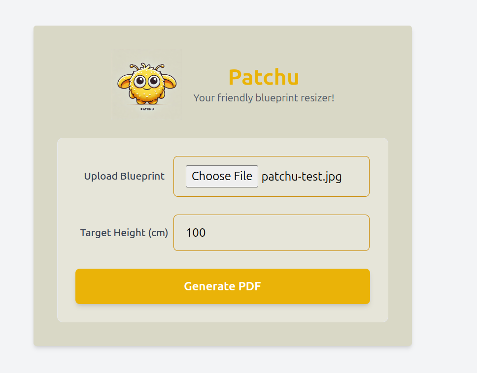

<div align="center">
  
  <h1 style="display: inline-block; vertical-align: middle;">Patchu</h1>
</div>

# Blueprint Resizer

**Patchu** is a simple web-based tool designed to help users resize sewing blueprints. It allows users to upload a blueprint image, specify the target height, and generate a printable PDF that can be printed on A4 paper, ready to be stitched together.

## Features
- Upload blueprints (JPEG, PNG, PDF).
- Input a target height to resize the blueprint.
- Generate a multi-page PDF that divides the blueprint into A4-sized sheets.
- Easy-to-use interface with responsive design.

## Technologies Used
- **Frontend**: HTML, TailwindCSS for styling.
- **Backend**: Python with Flask to handle requests.
- **Image Processing**: Pillow for scaling and slicing images, ReportLab for PDF generation.

## Setup Instructions

### Prerequisites
- Python 3.10+
- Docker (optional, for containerized deployment)

### Installation
1. Clone the repository:
   ```bash
   git clone https://github.com/n0ha/patchu.git
   cd patchu
   ```

2. Create a virtual environment and activate it:
   ```bash
   python -m venv .venv
   source .venv/bin/activate  # On Windows use `.venv\Scripts\activate`
   ```

3. Install the required packages:
   ```bash
   pip install -r requirements.txt
   ```

4. Run the Flask application:
   ```bash
   flask run
   ```
   The application will be available at `http://127.0.0.1:5000`.

### Docker Setup
1. Build the Docker image:
   ```bash
   docker build -t patchu .
   ```

2. Run the Docker container:
   ```bash
   docker run -d -p 5000:5000 patchu
   ```
   The application will be available on your local network at `http://<your-ip>:5000`.

## Usage
1. Open the application in your web browser.
2. Upload a blueprint image file.
3. Enter the target height in centimeters.
4. Click "Generate PDF" to get a printable version of the blueprint.

## Project Structure
- **app.py**: Main Flask application.
- **templates/index.html**: HTML template for the web interface.
- **static/logo.png**: Logo used in the interface.
- **requirements.txt**: List of required Python packages.
- **Dockerfile**: Instructions for building the Docker image.

## Screenshots
  
A simple and friendly UI for resizing your blueprints.

## License
This project is licensed under the MIT License. See the [LICENSE](LICENSE) file for more details.

## Contributing
Pull requests are welcome. For major changes, please open an issue first to discuss what you would like to change.
